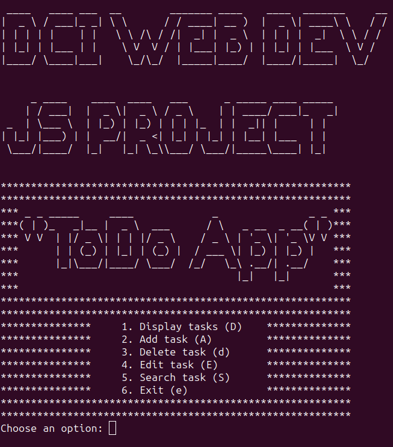

# JS Project - Todo App

This is a simple command-line based Todo App implemented in JavaScript. It allows users to manage their tasks by adding, deleting, editing, and searching tasks.

## Features

- Display tasks: View all the tasks in the task list.
- Add task: Add a new task to the task list.
- Delete task: Remove a task from the task list.
- Edit task: Modify the name of a task in the task list.
- Search task: Search for tasks based on a keyword.

## Getting Started

1. Clone the repository: `git clone <repository-url>`
2. Install the dependencies: `npm install`

## Usage

1. Choose an option from menu by writing either a number or a letter:
    - 1. Display tasks (D)
    - 2. Add task (A)
    - 3. Delete task (d)
    - 4. Edit task (E)
    - 5. Search task (S)
    - 6. Exit (e)
2. Follow the prompts to perform the desired action.

## Dependencies

- readline-sync: Used for reading user input from the command line.
- fs: Used for reading and writing data to the tasklist.json file.