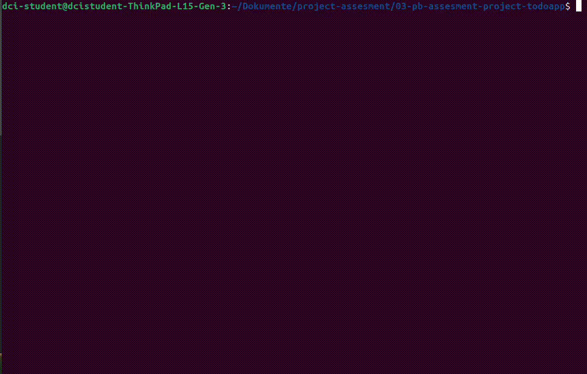
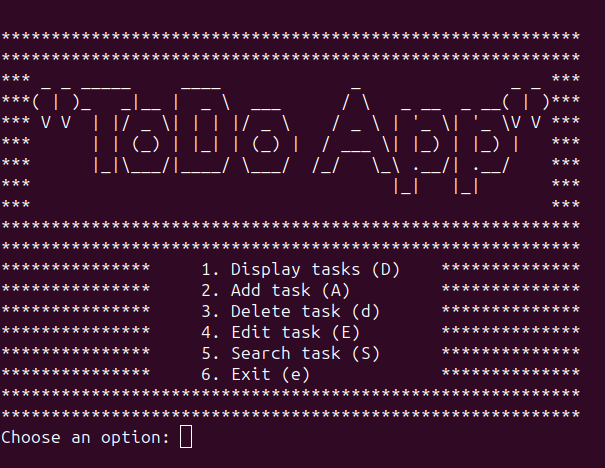

# Todo App

Dieses Projekt ist eine einfache command-line basierte Todo-Listen Applikation, die ich in JavaScript mit Node.js entwickelt habe. Sie ermöglicht den Benutzern/innen, ihre Aufgaben zu verwalten. Dazu bietet sie die Funktionen wie die Anzeige von Aufgaben, das Hinzufügen von neuen Aufgaben, das Löschen und Bearbeiten von Aufgaben und die Suche nach Aufgaben.




## Technology:

- ***Node.js***

## Abhängigkeiten (Dependencies):

- ***`readlineSync`***: Eine Node.js-Bibliothek, um die Eingaben von Benutzern zu bekommen.

- ***`fs`***: Das is in Node.js eingebaute Modul zur Handhabung von Dateisystemoperationen (File System). Wird zum Lesen und Schreiben in die Datei tasklist.json verwendet.

- ***`ora`***: Elegant terminal spinner.

- ***`chalk`***: Terminal String Styling.

## Erste Schritte

Um TodoApp zu verwenden, folgen Sie bitte den untenstehenden Schritten:

### Voraussetzungen

- Installieren Sie **Node.js** auf Ihren Computer.
- Installieren Sie **npm package manager**.

### Installation

1. Klonen Sie das Repository zu Ihrem lokal Computer:

    ```bash
    git clone https://github.com/alkanaziz/todoapp-js.git
    ```

2. Navigieren Sie zum Projektverzeichnis:

    ```bash
    cd todoapp-js
    ```

3. Installieren Sie die erforderlichen Abhängigkeiten:

    ```bash
    npm install
    ```

###  Verwendung
- Führen Sie die TodoApp aus, indem Sie den folgenden Befehl benutzen:

    ```bash
    node todoapp.js
    ```

- Die Anwendung zeigt ein **Menu** mit verschiedenen Optionen an:

1. ***Display tasks*** (um die Aufgaben anzuzeigen)
2. ***Add task*** (um eine neue Aufgabe zu hinzuzufügen)
3. ***Delete task*** (um eine Aufgabe zu löschen)
4. ***Edit task*** (um eine Aufgabe zu bearbeiten)
5. ***Search task*** (um nach eine Aufgabe zu suchen)
6. ***Exit*** (Ausfahrt)

- Wählen Sie eine Option, indem Sie die entsprechende Zahl eingeben. Dann folgen Sie den Aufforderungen, um die gewünschte Aktion auszuführen.

## Contributing

Jede Beiträge sind willkommen! Wenn Sie Probleme finden oder Verbesserungsvorschläge haben, erstellen Sie bitte ein neues Problem oder reichen Sie einen Pull-Request ein.